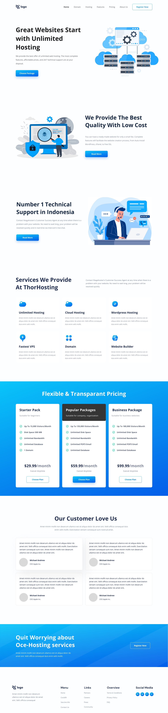

# Project 11

Hi, My name is **Danesh Tolani** and I have completed the 11th Project of the iNeuron Full Stack Course.

The most challenging things were:

- Adjusting all the divisions properly.
- Creating the cards for pricing.
- Positioning the content at proper position.

It took me **9 Hours** to complete this project

### Click on the below link to checkout the deployed website

